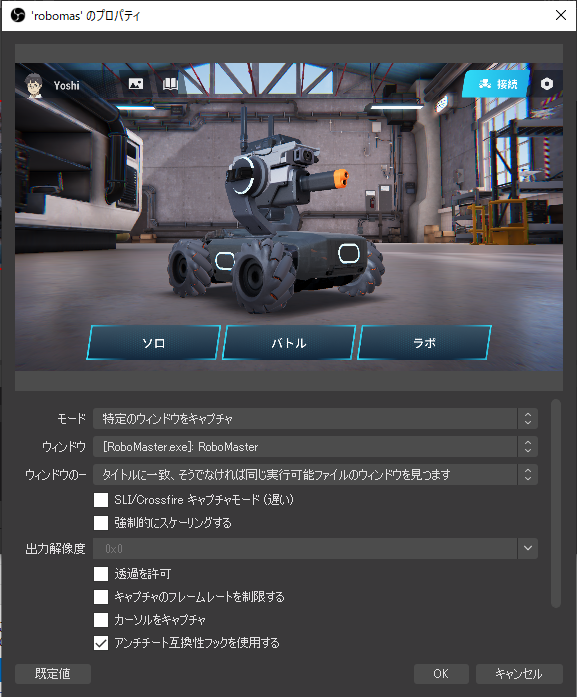

# これから何しよっか


## やったこと
- 接続周り
  - 接続OK
  - メッセージ送信


## やること
- 画像処理用


## ジンバル

右向きがYawの正，上向きがPitchの正

gimbal_followモードが良さそう

位置制御

```python
# Gimbal Lead
robot_ctrl.set_mode(rm_define.robot_mode_chassis_follow)

# Set chasis to follow Gimbal
chassis_ctrl.set_follow_gimbal_offset(0)
chassis_ctrl.set_rotate_speed(180)
gimbal_ctrl.set_rotate_speed(100)

# yaw positive is right side
gimbal_ctrl.yaw_ctrl(60)
gimbal_ctrl.yaw_ctrl(-60)
gimbal_ctrl.yaw_ctrl(0)
```

速度制御

```python
# Gimbal Lead
robot_ctrl.set_mode(rm_define.robot_mode_chassis_follow)

# Set chasis to follow Gimbal
chassis_ctrl.set_follow_gimbal_offset(0)
chassis_ctrl.set_rotate_speed(180)
gimbal_ctrl.set_rotate_speed(100)#無意味

gimbal_ctrl.rotate_with_speed(30, 10)
# 速度のOpenループは許されなかったorz
gimbal_ctrl.angle_ctrl(60, 15)
```

## Video Capture

RobomasterのVideoをCaptureする。

- OBS Studioを管理者権限で起動。（なぜならばRobomasterのアプリが管理者権限で起動するから）
- シーンを追加，ソースから「ゲームキャプチャを追加」
- 「ツール」→「Virtual Cam」



## Visual Tracking

超雑に考えると，uとvがそれぞれYaw（正）とPitch（負）に当てはまる。
ビジュアルサーボにおける速度制御が妥当と思われる。

$$
d = [u-u0,-(v-v0)]
$$

とすると，

$$
v = - K_p d
$$

とするべきだろう。$K_p$はPゲイン。速度制御は厳密にはできないので一定時刻動いてもらうことにする。